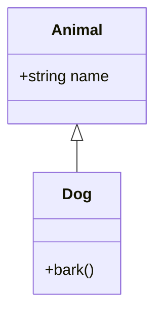

## This is a test
I added manually a page in the wiki because the wiki needs a minimum of one page to create the wiki repo

## it supports mermaid

```mermaid
classDiagram

class Animal{
    +string name
}

class Dog{
    +bark()
}

Animal <|-- Dog
```